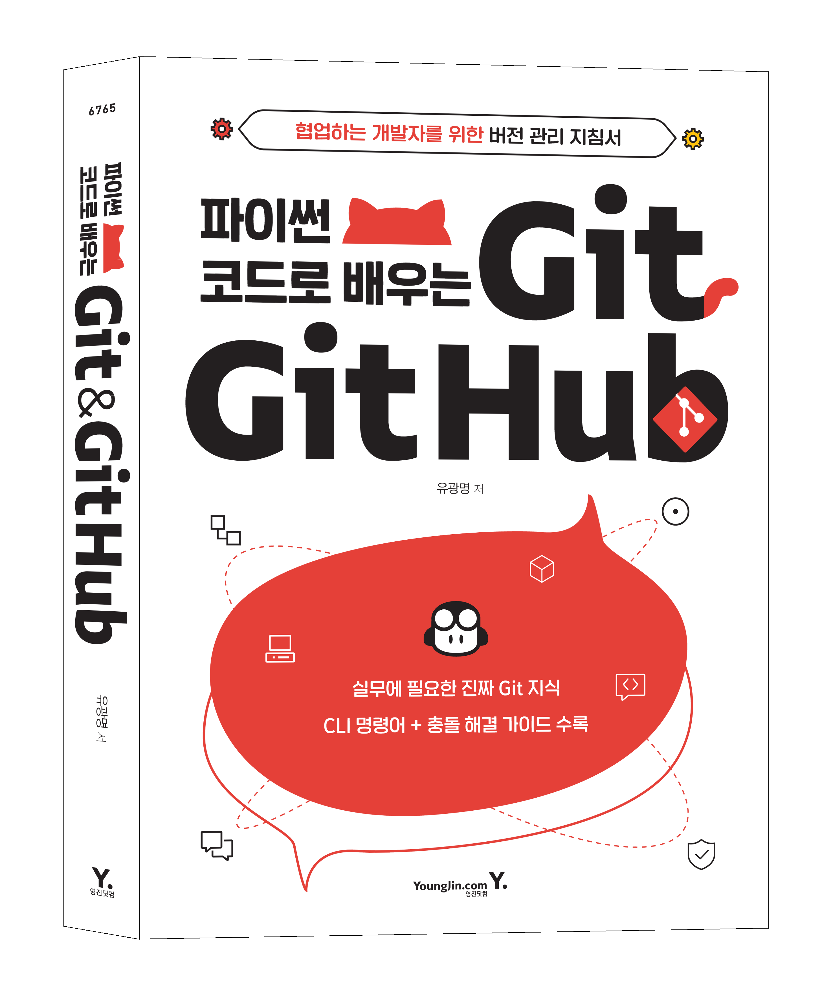

# *파이썬 코드로 배우는 Git & GitHub*

*파이썬 코드로 배우는 Git & Github* 도서의 예제코드 저장소입니다.



- 페이지 수 : 384쪽
- ISBN : 9788931467659 ( 8931467656 )
- 출판사 : [영진닷컴](https://www.youngjin.com/)
- 판매처
  - [교보문고](https://product.kyobobook.co.kr/detail/S000200345812)
  - [예스24](http://www.yes24.com/Product/Goods/115802695)
  - [영풍문고](https://www.ypbooks.co.kr/book.yp?bookcd=101207098&gubun=NV&NaPm=ct%3Dlbdapi34%7Cci%3De7a757e550aaea6572c009dd1b9867ede54d2cb6%7Ctr%3Dboksl1%7Csn%3D5295494%7Chk%3D51b8dd7d413821834614afbe215c6046af239191)
  - [알라딘](https://www.aladin.co.kr/shop/wproduct.aspx?ISBN=8931467656&start=pnaver_02)


### 저장소 구성

```
practice-git-materials
|
├── 01.code                          <- 실습에 사용된 파이썬 코드
├── 02.git_examples                  <- 챕터별 git 실습 저장소
│
└── README.md
```

